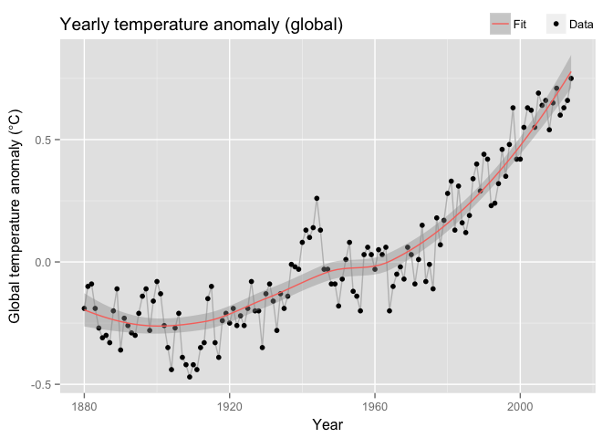
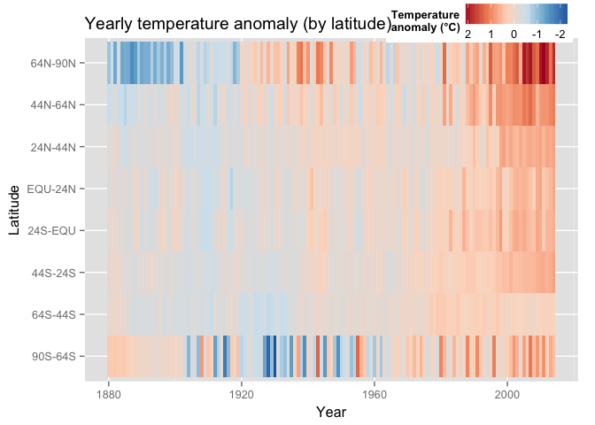

This document contains two visualizations of the data contained in [this dataset from the GISTEMP site](ExcelFormattedGISTEMPData2CSV.csv). The original dataset is described [here](http://data.giss.nasa.gov/gistemp/).

Briefly, the original dataset contains temperature anomalies (averaged over the year, measured in units of 0.01 degrees Celsius) as a function of time (year) and latitude. Temperature measurements are scaled against the 1950-1981 period.

This document contains both the visualizations, and the R code used to produce them. Each plot has an interactive version hosted on plot.ly.

Yearly global temperature anomaly
---------------------------------

#### [Interactive Version](https://plot.ly/~exostefanom/31.embed)

The plot above shows the global world temperature anomaly (in degrees Celsius) on the y-axis and time (years) on the x-axis.

Each data point is represented as a black dot. Overplotted is a smoothed version of the same data (red line), which shows the overall behavior of the temperature anomaly over time by smoothing over the small inter-year variations. The smoothing was done by fitting a LOESS function over groups of 80 year measurements. The gray shade represents the confidence intervals of the fit.

This plot shows a prominent increase in global temperature as a function of time, with an accelerating temperature growth post-1960s.

Yearly global temperature anomaly, by latitude
----------------------------------------------

#### [Interactive Version](https://plot.ly/~exostefanom/50.embed)

The plot above shows the temperature anomaly (in degrees Celsius) as a function of time (years) and latitude (°).

The temperature anomaly is plotted as a heat map, spanning from -2°C to +2°C. Latitude (on the y-axis) is divided into 8 chunks spanning from 90° south to 90° north.

This plot shows that the inter-year temperature variations are stronger at the highest latitudes (64°-90°), with the highest temperature anomaly peaks reached in the North Pole (top band).

Code
----

The code to reproduce the two visualizations is available [here].
